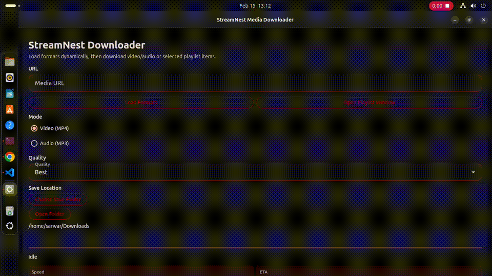

# StreamNest

StreamNest is a desktop media downloader built with **Flet** and **yt-dlp**.
It supports a wide range of sites/providers supported by `yt-dlp`, including single media downloads and playlist workflows.

## Demo

[](assets/Demo.mp4)

Click the preview to open the full `Demo.mp4`.

## Features

- Mobile-style bottom navigation tabs: **Single**, **Playlist**, **About**
- Dynamic format loading before download
- Download modes:
  - Video (MP4 remux)
  - Audio (MP3 extract)
- Playlist workflow:
  - Load playlist entries
  - Select specific items
  - Range input support (`1-5`, `1,3,7-10`)
  - Playlist-specific quality and save folder
- Live progress updates:
  - Progress bar
  - Speed and ETA
  - Current downloading playlist file name
- Completion and error result modals after downloads
- Download history panel
- Professional card-based responsive UI layout

## Requirements

- Python 3.11+
- FFmpeg (recommended for merge/remux/extract quality)

## Installation

1. Clone the repository:

```bash
git clone git@github.com:Sarwarhridoy4/StreamNest.git
cd StreamNest
```

2. Create and activate a virtual environment:

```bash
python -m venv .venv
source .venv/bin/activate
```

Windows (PowerShell):

```powershell
python -m venv .venv
.venv\Scripts\Activate.ps1
```

3. Install dependencies:

```bash
pip install -r requirements.txt
```

## FFmpeg Setup

- Linux: install `ffmpeg` via your package manager
- macOS: `brew install ffmpeg`
- Windows: install FFmpeg and add it to `PATH`

Verify:

```bash
ffmpeg -version
```

## How To Run

```bash
python main.py
```

## Build Linux Packages (.deb + .AppImage)

Install Linux build prerequisites first (Ubuntu/Debian):

```bash
sudo apt update
sudo apt install clang lld-20 cmake ninja-build pkg-config libgtk-3-dev desktop-file-utils dpkg-dev
```

Also ensure `appimagetool` is installed and available in `PATH`.

Then run the packaging script:

```bash
./scripts/build_linux_packages.sh 1.0.0 amd64
```

What the script does:

- Runs the official Flet command `flet build --yes linux` (with one automatic retry using `--clear-cache`)
- Uses the generated Linux bundle to produce `.deb` and `.AppImage`
- Writes package checksums

Outputs are written to `dist/`:

- `streamnest_<version>_amd64.deb`
- `StreamNest-<version>-x86_64.AppImage`
- `checksums-<version>.sha256`

## Usage

### Single download

1. Paste a supported media URL (`http://` or `https://`).
2. Click **Load Formats**.
3. Select mode and quality.
4. Choose save folder (optional).
5. Click **Download**.

### Playlist download

1. Open the **Playlist** bottom tab.
2. Paste playlist URL.
3. Optional: enter range (`1-5`, `1,3,7-10`).
4. Click **Load Playlist**.
5. Select items.
6. Choose quality and save folder.
7. Click **Download Selected**.

### About tab

1. Open the **About** bottom tab.
2. View developer and project information.
3. Use **Open GitHub** to open the developer profile.

## Fully Structured Folder Structure

```text
StreamNest/
├── main.py                     # App entry point and page bootstrapping
├── requirements.txt            # Python dependencies
├── README.md                   # Project documentation
├── LICENSE                     # MIT license
├── services/
│   ├── downloader.py           # yt-dlp download orchestration, hooks, progress
│   └── format_extractor.py     # Format and playlist metadata extraction
├── state/
│   └── app_state.py            # Shared UI state model
├── ui/
│   ├── components.py           # Reusable UI components/helpers
│   └── home_view.py            # Single/Playlist/About tab UI and interaction logic
└── utils/
    ├── file_manager.py         # Directory helpers and size/speed/eta formatters
    └── validators.py           # URL and input validation helpers
```

## Troubleshooting

### Progress updates seem delayed

- Ensure dependencies are installed in the active virtual environment.
- Check terminal logs for runtime exceptions.

### Speed/ETA not visible on some media

- Some providers/streams do not expose stable throughput metrics.
- Keep `yt-dlp` and FFmpeg updated.

### Post-processing errors

- Confirm `ffmpeg` is available in `PATH`.
- Verify using `ffmpeg -version`.

### Linux build fails with `Failed to find any of [ld.lld, ld]`

- Install the linker toolchain for LLVM 20: `sudo apt install lld-20`
- Verify the binary exists: `/usr/lib/llvm-20/bin/ld.lld`
- Re-run: `./scripts/build_linux_packages.sh 1.0.0 amd64`

## Developer

- Name: Sarwar Hossain
- GitHub: [Sarwarhridoy4](https://github.com/Sarwarhridoy4)

## License

This project is licensed under the MIT License. See `LICENSE`.

## Disclaimer

Use this software lawfully and in compliance with platform terms, copyright, and local regulations.
