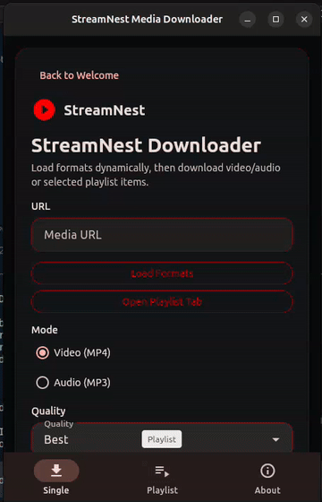
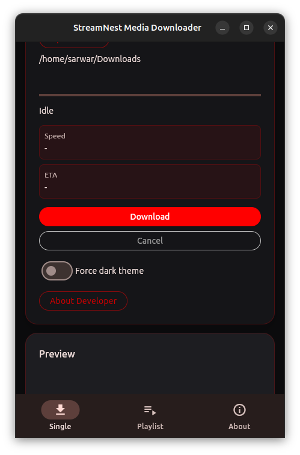
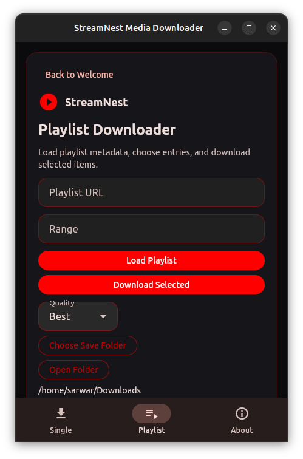
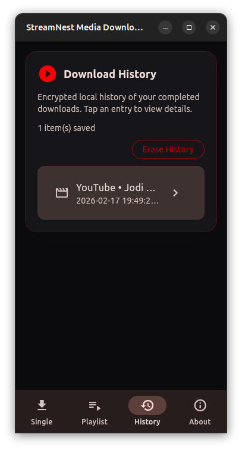
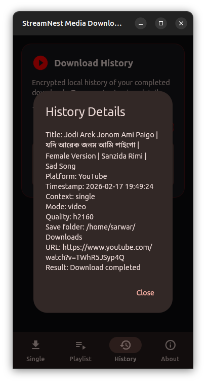
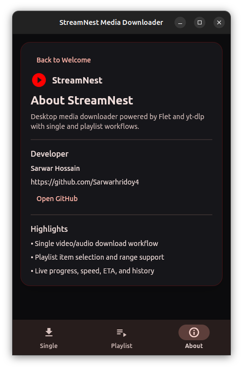

# StreamNest

StreamNest is a desktop media downloader built with **Flet** and **yt-dlp**. It supports single media downloads and playlist workflows across providers supported by `yt-dlp`.

## Demo

[](assets/demo/demo.mp4)

Click the preview to open the full demo video.

## Screenshots

### Single Downloader



### Playlist Downloader



### History



### History Details



### About



## Key Features

- Welcome-first entry flow with one-click launch into the app
- Centered card-based UI with bottom navigation tabs: **Single**, **Playlist**, **About**
- Back-to-welcome action available from all app cards
- Unified app branding with official play-circle icon assets
- Device-theme aware styling:
  - Follows system theme by default
  - Live updates on platform brightness change (when supported)
  - Optional **Force dark theme** override
- Startup FFmpeg detection with OS-specific install guidance in the UI
- One-click FFmpeg auto-install flow (Linux/macOS/Windows) with confirmation and privilege prompt support
- Live install/output log windows:
  - FFmpeg installer command output
  - `yt-dlp` runtime logs for active downloads
- Manual FFmpeg re-check action from the UI
- Dynamic format loading before download
- Download modes:
  - Video (MP4 remux)
  - Audio (MP3 extract)
- Playlist workflow:
  - Load playlist entries
  - Select specific items
  - Range support (`1-5`, `1,3,7-10`)
  - Playlist-specific quality and save folder
- Live progress information:
  - Progress bar
  - Speed and ETA
  - Current playlist file name
- Download result dialogs and session history panel

## Changelog

- See [Changelog](changelog.md) for release notes and ongoing updates.

## Requirements

- Python 3.11+
- FFmpeg (recommended for merge/remux/extract quality)

## Installation

1. Clone the repository:

```bash
git clone git@github.com:Sarwarhridoy4/StreamNest.git
cd StreamNest
```

2. Create and activate a virtual environment:

```bash
python -m venv .venv
source .venv/bin/activate
```

Windows (PowerShell):

```powershell
python -m venv .venv
.venv\Scripts\Activate.ps1
```

3. Install dependencies:

```bash
pip install -r requirements.txt
```

## FFmpeg Setup

- Automatic install from the app:
  - Click **Install FFmpeg** when prompted
  - Review command preview and confirm
  - Enter password (Linux privilege flow) when required
  - Track progress in **FFmpeg Install Log**
- Manual install:
  - Linux: install `ffmpeg` with your package manager
  - macOS: `brew install ffmpeg`
  - Windows: install FFmpeg and add it to `PATH` (or use Winget)

Verify:

```bash
ffmpeg -version
```

## Run

```bash
python main.py
```

## Usage

### Single Download

1. Paste a supported media URL (`http://` or `https://`).
2. Click **Load Formats**.
3. Select mode and quality.
4. Choose save folder (optional).
5. Click **Download**.

### Playlist Download

1. Open the **Playlist** tab.
2. Paste playlist URL.
3. Optional: enter range (`1-5`, `1,3,7-10`).
4. Click **Load Playlist**.
5. Select items.
6. Choose quality and save folder.
7. Click **Download Selected**.

### Welcome and Theme Behavior

1. App starts on the **Welcome** screen.
2. Click **Open StreamNest** to enter the tabbed app UI.
3. Use **Back to Welcome** to return to the welcome screen.
4. Theme follows your system setting by default.
5. Enable **Force dark theme** in Single tab to override system theme.

## Build Linux Packages (.deb + .AppImage)

Install prerequisites first (Ubuntu/Debian):

```bash
sudo apt update
sudo apt install clang lld-20 cmake ninja-build pkg-config libgtk-3-dev desktop-file-utils dpkg-dev
```

Ensure `appimagetool` is installed and available in `PATH`.

Run packaging:

```bash
./scripts/build_linux_packages.sh 2.0 amd64
```

Verbose mode (show full apt/pip/flet output live):

```bash
./scripts/build_linux_packages.sh 2.0 amd64 --verbose
```

The script:

- Runs `flet build --yes linux` (with one retry using `--clear-cache`)
- Builds `.deb` and `.AppImage` from the generated Linux bundle
- Writes package checksums
- Supports `--verbose` (or `-v`) to stream full command output; default mode is compact and styled

Output files in `dist/`:

- `streamnest_<version>_amd64.deb`
- `StreamNest-<version>-x86_64.AppImage`
- `checksums-<version>.sha256`

## Build Android APK

Follow the official guide for environment setup (Java, Android SDK, Android command-line tools):

- https://docs.flet.dev/publish/android/

With this repo on the `android` branch:

1. Install dependencies:

```bash
pip install -r requirements.txt
```

2. Build APK:

```bash
flet build apk
```

3. Optional release build:

```bash
flet build apk --release
```

Android packaging metadata is configured in `pyproject.toml` under `[tool.flet]` and `[tool.flet.android]`.

## Project Structure

```text
StreamNest/
├── main.py                     # App entry point and page bootstrapping
├── requirements.txt            # Python dependencies
├── README.md                   # Project documentation
├── changelog.md                # Project change history
├── LICENSE                     # MIT license
├── assets/                     # Icons, demo media, screenshots
├── services/
│   ├── downloader.py           # yt-dlp orchestration, hooks, progress
│   └── format_extractor.py     # Format and playlist metadata extraction
├── state/
│   └── app_state.py            # Shared UI state model
├── ui/
│   ├── components.py           # Reusable UI helpers
│   ├── home_view.py            # Compatibility wrapper exporting HomeView
│   └── home/                   # Modular HomeView implementation
│       ├── home_view.py        # Core HomeView shell/state and shared handlers
│       ├── control_layout_mixin.py
│       ├── view_layout_mixin.py
│       ├── download_mixin.py
│       ├── playlist_mixin.py
│       ├── history_mixin.py
│       └── ffmpeg_install_mixin.py
└── utils/
    ├── file_manager.py         # Directory helpers + size/speed/eta formatters
    └── validators.py           # URL and input validation helpers
```

## Troubleshooting

### Progress updates seem delayed

- Ensure dependencies are installed in the active virtual environment.
- Check terminal output for runtime exceptions.

### Speed/ETA missing on some media

- Some providers/streams do not expose stable throughput metrics.
- Keep `yt-dlp` and FFmpeg updated.

### Post-processing errors

- Confirm `ffmpeg` is available in `PATH`.
- Verify with `ffmpeg -version`.

### Linux build fails with `Failed to find any of [ld.lld, ld]`

- Install linker toolchain for LLVM 20: `sudo apt install lld-20`
- Verify binary exists: `/usr/lib/llvm-20/bin/ld.lld`
- Re-run: `./scripts/build_linux_packages.sh 2.0 amd64`

## Developer

- Name: Sarwar Hossain
- GitHub: [Sarwarhridoy4](https://github.com/Sarwarhridoy4)

## License

This project is licensed under the MIT License. See `LICENSE`.

## Disclaimer

Use this software lawfully and in compliance with platform terms, copyright, and local regulations.
